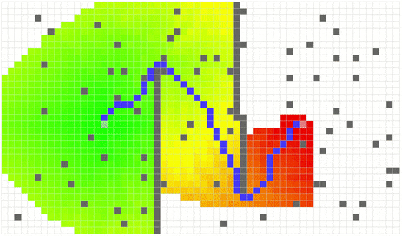

# Pathsim
Pathsim is playground for different path planning algorithms. Due to its focus on learning how the different algorithms work, I decided to use Javascript/HTML/CSS/SVG.

[Live Playgroud][8f232bb3]

  [8f232bb3]: http://oliverguhr.github.io/pathsim/ "pathsim"

## Done
1. Setup (Project / NPM / Build / Libs)
2. We need a map
3. Add obstacles to the map
4. Add these obstacles via use input
5. Implement Dijkstra
6. Implement A*
7. Moveable Objects
8. Cost visualization
9. Step by step execution
10. Implement LPA*

## Todos
1. Robot
2. Proper Tests
3. D* Lite
4. Add build steps, remove node_modules folder

## Tests
Run all tests:
- npm test

To watch test folder for changes and rerun tests please install:
- npm install watch -g

than type:
- npm run watch-test

## Licence
MIT
